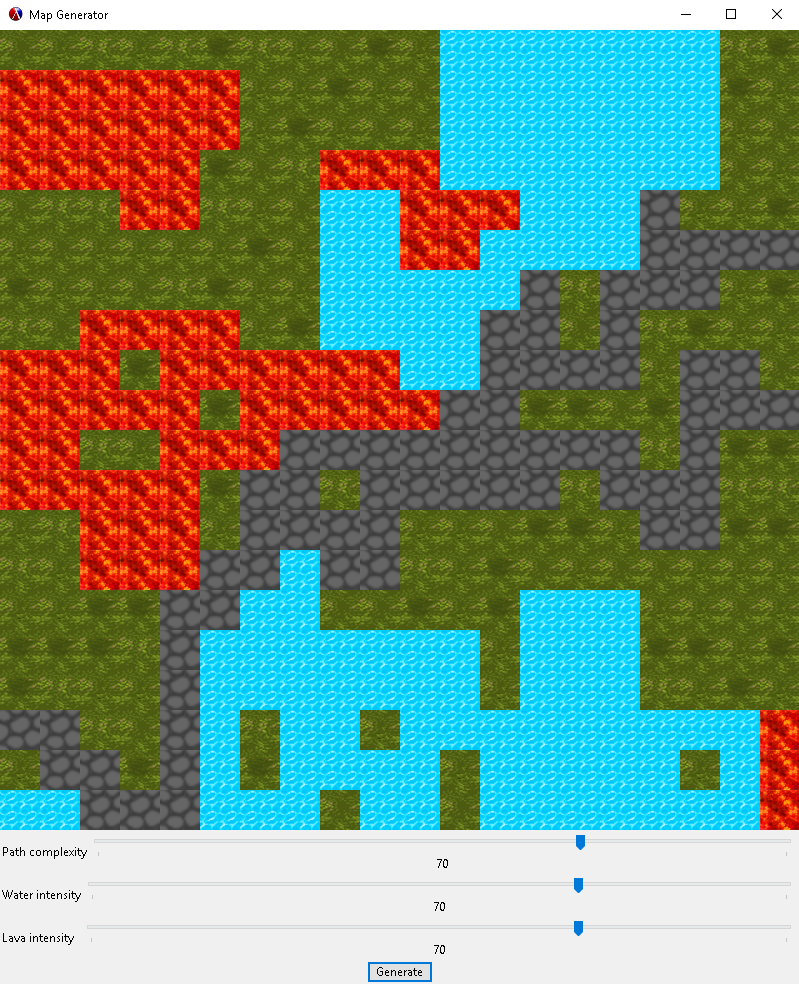

# Random Map Generator

##Authors
Adam Melle
John Perkins

##Overview
Our project is a map generator that generates random game tilemaps. The program allows the user to adjust the chance to generate certain elements of the map. The generate button can then be clicked to generate a unique map each time. The maps generated will always have a clear path from the left side to the right, without anything obstructing the path. 

##Screenshot
Here's an example of a randomly generated map.


##Concepts Demonstrated
Identify the OPL concepts demonstrated in your project. Be brief. A simple list and example is sufficient. 
* **Data abstraction** is used to provide access to the elements of the RSS feed.
* The objects in the OpenGL world are represented with **recursive data structures.**
* **Symbolic language processing techniques** are used in the parser.

##External Technology and Libraries
Briefly describe the existing technology you utilized, and how you used it. Provide a link to that technology(ies).

##Favorite Scheme Expressions
####Mark (a team member)
Each team member should identify a favorite expression or procedure, written by them, and explain what it does. Why is it your favorite? What OPL philosophy does it embody?
Remember code looks something like this:
```scheme
(map (lambda (x) (foldr compose functions)) data)
```
####Lillian (another team member)
This expression reads in a regular expression and elegantly matches it against a pre-existing hashmap....
```scheme
(let* ((expr (convert-to-regexp (read-line my-in-port)))
             (matches (flatten
                       (hash-map *words*
                                 (lambda (key value)
                                   (if (regexp-match expr key) key '()))))))
  matches)
```

##Additional Remarks
Anything else you want to say in your report. Can rename or remove this section.

#How to Download and Run
You may want to link to your latest release for easy downloading by people (such as Mark).

Include what file to run, what to do with that file, how to interact with the app when its running, etc. 

